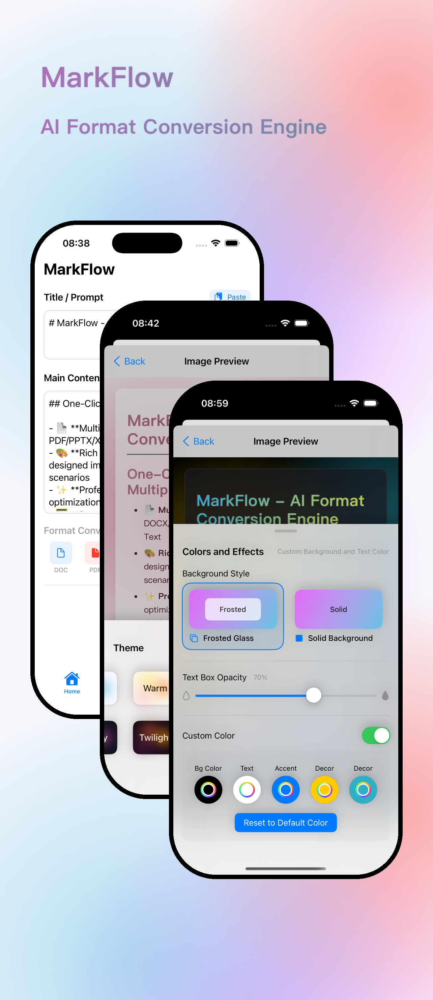

# App Store Screenshot Generator

[](https://opensource.org/licenses/MIT)

[中文文档](README.zh-CN.md) | [English](README.md)

A simple Python script using Pillow to create app store-style screenshots by placing framed device mockups onto a background image.


*(Example generated using the script)*

## Features

*   Place one or more screenshots onto a background.
*   Uses relative positioning and sizing for easy adjustments.
*   Customizable device frame border width and corner radius (relative to device size).
*   Control stacking order using `z_order`.
*   Requires only Python 3 and Pillow.

## Prerequisites

*   Python 3.6+
*   Pillow (Python Imaging Library)

## Installation

1.  **Clone the repository:**
    ```bash
    git clone https://github.com/your-username/app-store-screenshot-generator.git
    cd app-store-screenshot-generator
    ```

2.  **Install dependencies:**
    ```bash
    pip install -r requirements.txt
    ```
    
    Alternatively, you can simply install Pillow directly:
    ```bash
    pip install Pillow
    ```

## Usage

1.  **Prepare your images:**
    *   Place your background image (e.g., `background.jpeg`) in the repository's root directory.
    *   Place your app screenshot images (e.g., `screenshot1.png`, `screenshot2.png`, `screenshot3.png`) in the root directory.
        *(The script includes examples using these filenames.)*

2.  **Run the script:**
    The script includes built-in examples. To generate them:
    ```bash
    python app_store_screenshot_generator.py
    ```
    This will:
    *   Check if `background.jpeg`, `screenshot1.png`, `screenshot2.png`, and `screenshot3.png` exist.
    *   Generate example screenshots (single, double, triple-overlap) based on the configurations in the script's `if __name__ == "__main__":` block.
    *   Save the output images to the `output/` directory (which will be created if it doesn't exist).

3.  **Customize (Optional):**
    *   Modify the `EXAMPLE_DEFINITIONS` dictionary within the `app_store_screenshot_generator.py` script to use your own image filenames, adjust relative sizes/positions, borders, corners, and output filenames.
    *   Alternatively, import the `create_app_store_screenshot` function into your own Python script for more complex workflows.

### Configuration Parameters

When configuring screenshots (in the `screenshots_config` list), use these keys in each dictionary:

*   `image`: (Required) Path to the screenshot file (string).
*   `relative_width`: (Required) Desired device frame width as a fraction of the background image width (e.g., `0.8` for 80%).
*   `relative_position`: (Required) Tuple `(rel_x, rel_y)` for the *center* of the device frame relative to the background dimensions (e.g., `(0.5, 0.5)` for center).
*   `relative_border_width`: (Optional) Border width as a fraction of device width. Defaults to `0.02` (2%).
*   `relative_corner_radius`: (Optional) Corner radius as a fraction of device width. Defaults to `0.2` (20%).
*   `z_order`: (Optional) Integer for stacking order (higher value is on top). Defaults to `0`.

## Examples

Here are some examples of input images and the resulting output:

| Input Images | Output Result | Configuration |
|--------------|---------------|---------------|
|  +  |  | Single centered device |
|  +  +  |  | Two devices side by side |
|  +  +  +  |  | Three overlapping devices with z-ordering |

## License

This project is licensed under the MIT License - see the [LICENSE](LICENSE) file for details.