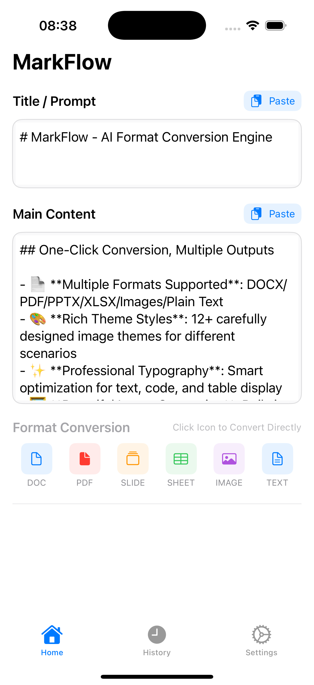
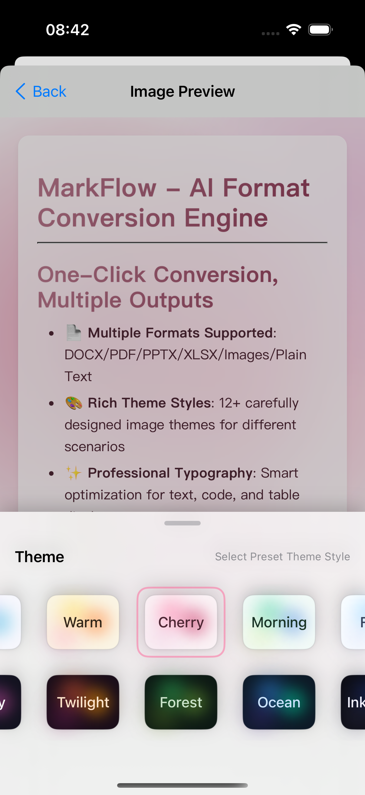
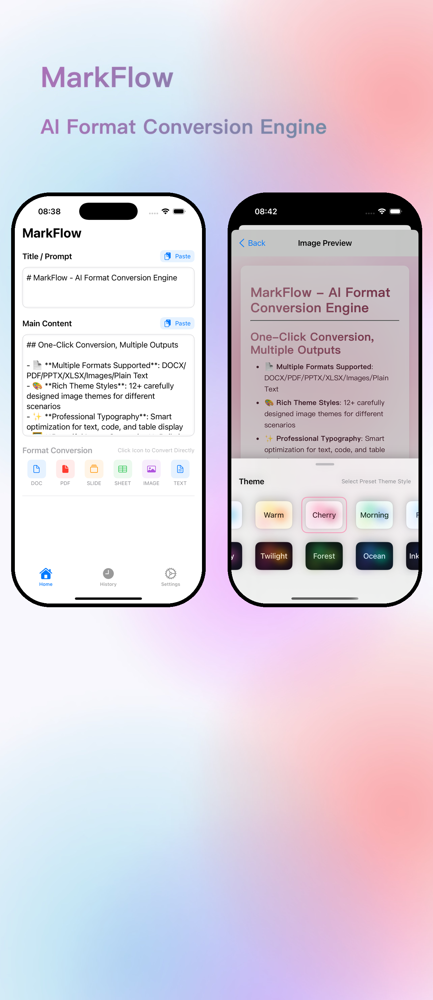
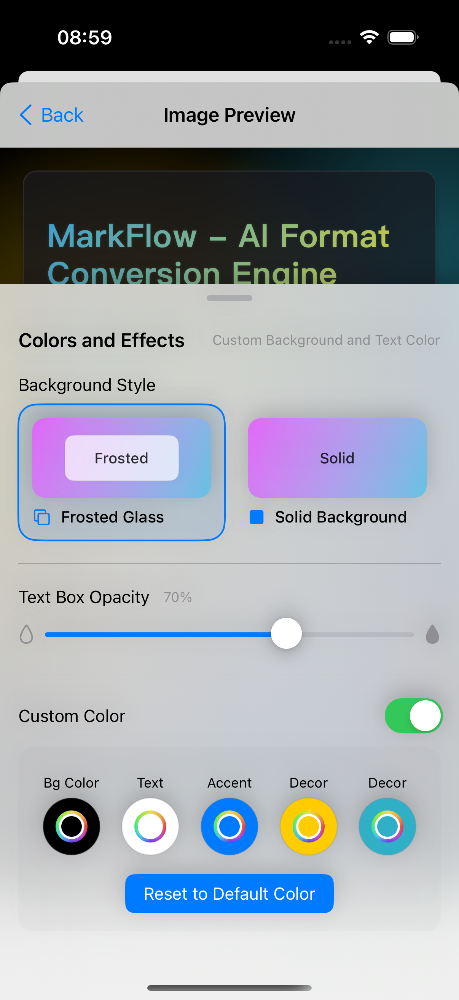

# App Store 截图生成器

[](https://opensource.org/licenses/MIT)

一个简单的 Python 脚本，使用 Pillow 库通过将带框架的设备模型放置在背景图像上来创建 App Store 风格的截图。


*（使用脚本生成的示例）*

## 功能特点

* 将一个或多个截图放置在背景上。
* 使用相对定位和大小调整，便于调整。
* 可自定义设备框架边框宽度和圆角半径（相对于设备大小）。
* 使用 `z_order` 控制堆叠顺序。
* 仅需 Python 3 和 Pillow。

## 前提条件

* Python 3.6+
* Pillow（Python 图像处理库）

## 安装

1. **克隆仓库：**
   ```bash
   git clone https://github.com/your-username/app-store-screenshot-generator.git
   cd app-store-screenshot-generator
   ```

2. **安装依赖：**
   ```bash
   pip install -r requirements.txt
   ```
   
   或者，您也可以直接安装 Pillow：
   ```bash
   pip install Pillow
   ```

## 使用方法

1. **准备您的图像：**
   * 将您的背景图像（例如 `background.jpeg`）放在仓库的根目录中。
   * 将您的应用截图（例如 `screenshot1.png`、`screenshot2.png`、`screenshot3.png`）放在根目录中。
     *（脚本包含使用这些文件名的示例。）*

2. **运行脚本：**
   脚本包含内置示例。要生成它们：
   ```bash
   python app_store_screenshot_generator.py
   ```
   这将：
   * 检查 `background.jpeg`、`screenshot1.png`、`screenshot2.png` 和 `screenshot3.png` 是否存在。
   * 根据脚本的 `if __name__ == "__main__":` 块中的配置生成示例截图（单个、双个、三重重叠）。
   * 将输出图像保存到 `output/` 目录（如果该目录不存在，将创建它）。

3. **自定义（可选）：**
   * 修改 `app_store_screenshot_generator.py` 脚本中的 `EXAMPLE_DEFINITIONS` 字典，使用您自己的图像文件名，调整相对大小/位置、边框、圆角和输出文件名。
   * 或者，将 `create_app_store_screenshot` 函数导入到您自己的 Python 脚本中，以实现更复杂的工作流程。

### 配置参数

在配置截图时（在 `screenshots_config` 列表中），在每个字典中使用以下键：

* `image`：（必需）截图文件的路径（字符串）。
* `relative_width`：（必需）所需设备框架宽度，表示为背景图像宽度的分数（例如，`0.8` 表示 80%）。
* `relative_position`：（必需）元组 `(rel_x, rel_y)`，表示设备框架的*中心*相对于背景尺寸的位置（例如，`(0.5, 0.5)` 表示居中）。
* `relative_border_width`：（可选）边框宽度，表示为设备宽度的分数。默认为 `0.02`（2%）。
* `relative_corner_radius`：（可选）圆角半径，表示为设备宽度的分数。默认为 `0.08`（8%）。
* `z_order`：（可选）堆叠顺序的整数（值越高越靠上）。默认为 `0`。

## 示例

以下是一些输入图像和生成结果的示例：

| 输入图像 | 输出结果 | 配置 |
|--------------|---------------|---------------|
|  +  |  | 单个居中设备 |
|  +  +  |  | 两个并排设备 |
|  +  +  +  |  | 三个重叠设备，带有 z 轴排序 |

## 许可证

本项目采用 MIT 许可证 - 详情请参阅 [LICENSE](LICENSE) 文件。